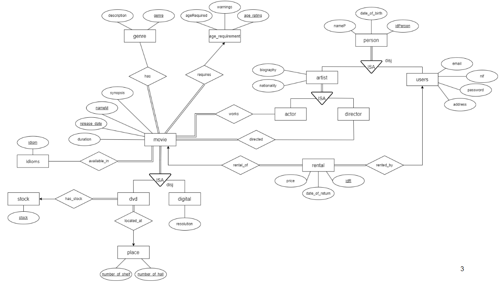

# Video Library - Movie Rental Database System

**Video Library** is a comprehensive database project designed to manage a film rental shop offering movies in both physical (DVD) and digital formats. The system handles the management of clients, rentals, and a detailed movie catalog.

## Contributors
* **Catarina Aboim**
* **Gonçalo Mourão**
* **Ruben Sousa**

---

## Project Overview
The primary goal of this system is to organize movie rentals, ensuring all relevant information - from client data to physical stock levels is tracked.

### Key Features
* **Movie Catalog**: Stores movie names, release dates, durations, synopses, age ratings, and available languages.
* **Format Support**: Manages **DVD** formats (tracking stock and store location) and **Digital** formats (tracking resolution).
* **Client Management**: Maintains detailed profiles including NIF (tax ID), email, address, and rental history.
* **Artist Database**: Tracks actors and directors, including their nationality and biographies.
* **Rental Logic**: Ensures users cannot rent the same movie twice and tracks return dates and prices.

---

## Database Architecture

### Entity-Relationship (ER) Model
The ER model defines core entities like *Movie*, *Person*, *Rental*, and *Place*. Key design improvements made during development include:
* **Artist Specialization**: Artists are specialized as either Actors or Directors.
* **Stock Management**: A dedicated `Stock` entity was created to better track physical DVD availability.
* **Age Calculation**: Instead of storing static ages, the system uses birth dates to calculate age dynamically.

### Relational Model
The database is structured using tables such as:
* `movie(nameM, release_date, duration, synopsis, age_rating)`
* `user(idPerson, email, nif, password, address)`
* `rental(idR, date_of_return, price, idPerson, nameM, release_date)`
* `dvd(nameM, release_date, number_of_shelf, number_of_hall)`

### Normalization
The system is verified to be in **Boyce-Codd Normal Form (BCNF)** and **4th Normal Form (4NF)**, ensuring data integrity and minimizing redundancy.

---

## SQL Implementation

The project utilizes advanced SQL features to automate business rules:
* **Triggers**:
    * **Age Verification**: Prevents minors from renting movies above their age rating.
    * **Stock Control**: Automatically updates DVD stock levels when a rental occurs.
    * **Data Validation**: Ensures release dates and birth dates are not set in the future.
* **Procedures**:
    * `INSERT_MOVIE`: Validates that every movie has at least one actor, director, genre, and language before entry.
    * `INSERT_DVD`: Automatically manages physical location and stock during entry.
* **Functions**:
    * A utility to convert movie duration (seconds) into a readable `HH:MM:SS` format.

---

## Application Roles (Oracle APEX)

### Administrator
* **Manage Catalog**: Full CRUD (Create, Read, Update, Delete) access for Digital and DVD movies.
* **Manage Personnel**: Oversee user accounts and artist biographies.
* **Business Insights**: View statistics like the most rented movie, most popular genre, and top users.

### User
* **Filtered Catalog**: View movies available specifically for the user's age group.
* **Rental History**: Access a personal dashboard showing past rentals and total rental counts.
* **Search & Discovery**: Find movies by specific artists or view detailed cast/crew lists.

---

## Technical Stack
* **Database Engine**: Oracle Database
* **Platform**: Oracle APEX 23.2.4